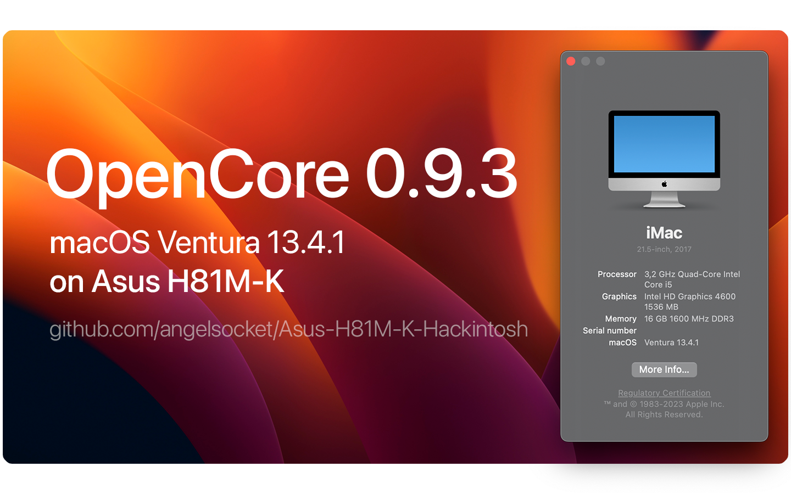

# 👋 Hello! This is Hackintosh for Asus H81M-K

## Hardware ⚙️
- Motherboard: ASUS H81M-K
- CPU: Intel Core i5 4570
- GPU: Intel HD Graphics 4600 (Patched using OCLP)
- RAM: 16GB 1600 DDR3 Kingston KVR16N11/8
- SSD: 120GB Samsung MZ7LN128HAHQ-000L2

## Software 💾
- Bootloader: OpenCore 0.9.3
- macOS: Ventura 13.4.1
- BIOS: 3604

## What works and what doesn't

<strong> Click to open! </strong>

 

- 🟢 - Fully working
- 🟠 - Partially working
- 🔴 - Not working

> ### Hardware

| Feature                              | Status | Dependency          |
| :----------------------------------- | ------ | ------------------- |
| Graphics (HD 4600)                   | 🟢  | `WhateverGreen.kext` & OCLP 0.6.7 |
| Sound (ALC887)                       | 🟢  | `AppleALC.kext` & alcid=53 |
| USB Ports                            | 🟢  | Native |
| Ethernet                             | 🟢  | `RealtekRTL8111.kext` | 
| Sleep                                | 🟢  | Native |
| VGA Port                             | 🔴  | Does not exist on real apple computers |

> ### macOS Continuity

| Feature                              | Status | Dependency          |
| :----------------------------------- | ------ | ------------------- |
| iCloud, iMessage, FaceTime           | 🟢   | Whitelisted Apple ID, Valid SMBIOS  |
| Time Machine                         | 🟢   | Native  |
| AirDrop                              | 🟠   | Needed WiFi and Bluetooth  |

## Before Install
- [**Click**](/Files/BeforeInstall.md): Requirements before installing.
  
## Installation macOS
- [**Click**](https://dortania.github.io/OpenCore-Install-Guide/installer-guide/): Creating a macOS installer
- [**Click**](https://dortania.github.io/OpenCore-Install-Guide/installation/installation-process.html): Installation macOS

## Post Install
- [**Click**](/Files/PostInstall.md): Requirements after installing.

## Contact
- [**@angelsocket**](https://t.me/angelsocket): Telegram

## Credits 💖
- Apple for macOS
- Acidanthera team for OpenCore
- CorpNewt for GenSMBIOS
- Andrej-Antipov for MountEFI
- xzhih for one-key-hidpi
